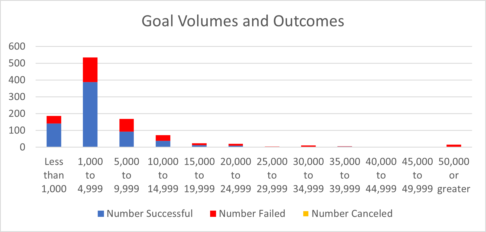

# Kickstarting with Excel

## Overview of Project
Analysis of Kickstarter Theatre campaigns and the impact launch dates and funding goals have on overall campaign performance. 
### Purpose
Determining the ideal launch date and appetite for funding.  
## Analysis and Challenges

### Analysis of Outcomes Based on Launch Date
The graphics below show funding outcomes based on campaign launch month within the Theatre category (analysis based on 1,369 unique campaigns launched between 2010-2017). 

The top graphic shows that the late spring early summer months generally have the highest volumes of new campaign launches, May leads the way followed by June and July. Not only do May, June, and July have the highest launch volumes but also the highest rate of success as shown in the bottom graphic above. December on the other hand has both the lowest launch volume and success rate.
### Analysis of Outcomes Based on Goals
The graphics below show outcomes based on campaign funding goal within the Play subcategory (analysis based on 1,047 unique campaigns launched between 2010-2017). 

The "Outcomes Based on Goal" graphic above shows that the campaigns with the highest rate of success are in the found within the two lowest goal buckets (76% and 73% respectively). Although there is an elevated rate of success for the 35k-40k and 40k-45k buckets, the volumes are too low (see "Goal Volumes and Outcomes" chart above) to draw any meaningful conclusions. 
### Challenges and Difficulties Encountered
Although there were minimal issues faced performing this analysis, the volume issue stated above can makes it difficult to make confident recommendations based on more granular criteria elements. 
## Results

- What are two conclusions you can draw about the Outcomes based on Launch Date?

- What can you conclude about the Outcomes based on Goals?

- What are some limitations of this dataset?

- What are some other possible tables and/or graphs that we could create?
