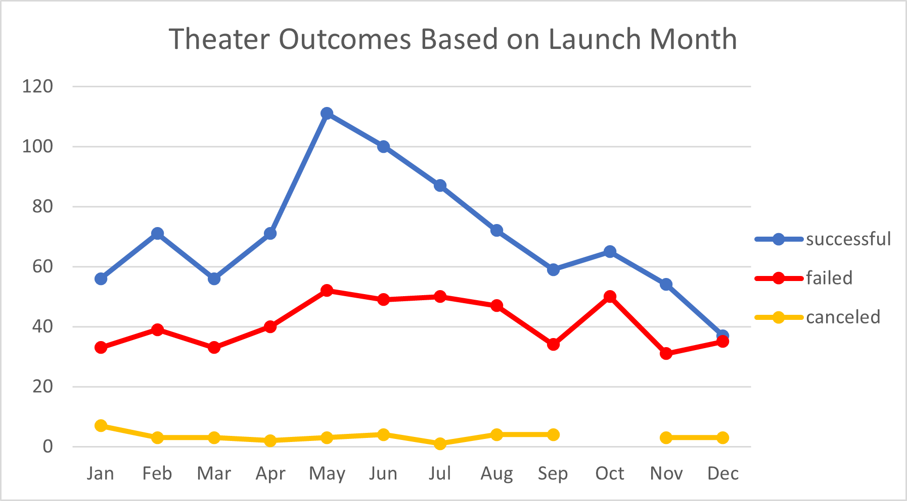
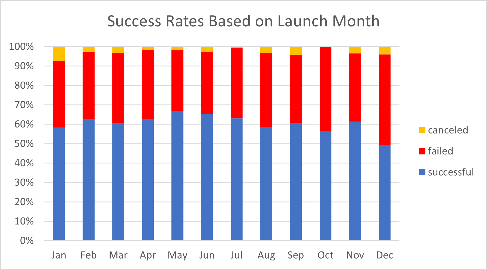
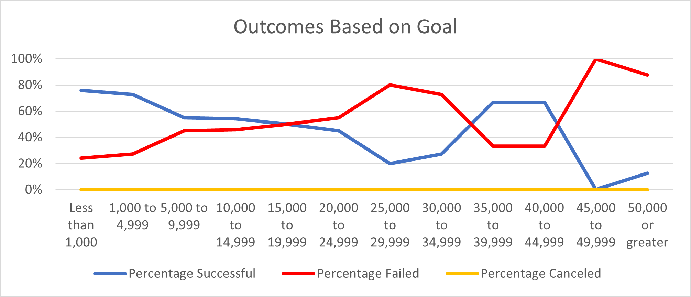

# Kickstarting with Excel

## Overview of Project
Analysis of Kickstarter Theatre campaigns and the impact launch dates and funding goals have on overall campaign performance. 
### Purpose
Determining the ideal launch date and appetite for funding.  
## Analysis and Challenges

### Analysis of Outcomes Based on Launch Date
The graphics below show theatre funding outcomes based on campaign launch month (data 2010-2017). 

The top graphic shows that the late spring early summer months generally have the highest volumes of new campaign launches, May leads the way followed by June and July. Not only do May, June, and July have the highest launch volumes but also the highest rate of success as shown in the bottom graphic above. December on the other hand has both the lowest launch volume and success rate.
### Analysis of Outcomes Based on Goals

### Challenges and Difficulties Encountered

## Results

- What are two conclusions you can draw about the Outcomes based on Launch Date?

- What can you conclude about the Outcomes based on Goals?

- What are some limitations of this dataset?

- What are some other possible tables and/or graphs that we could create?
